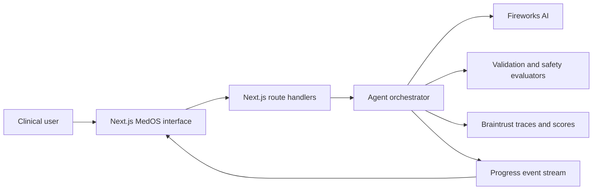
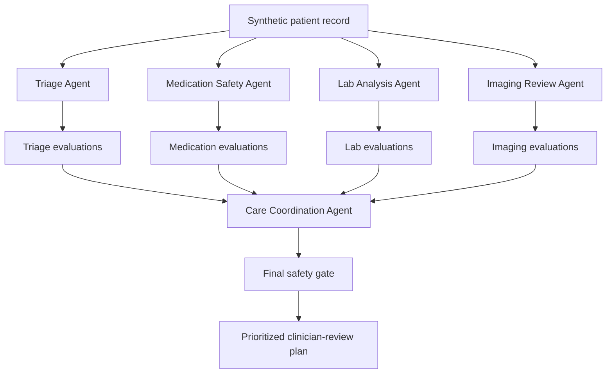

# MedOS Architecture

## Purpose

MedOS is an AI-powered emergency department operations platform and clinical decision support proof of concept. The architecture is optimized for a reliable hackathon demonstration of coordinated agents, structured safety checks, and visible AI observability.

All patient information is synthetic. MedOS does not provide medical advice, make autonomous clinical decisions, or replace licensed clinicians.

> **Fireworks powers the intelligence; Braintrust builds trust.**

## Technology stack

- **Application framework:** Next.js App Router.
- **Language:** TypeScript.
- **Styling:** Tailwind CSS.
- **Component system:** shadcn/ui.
- **Runtime validation:** Zod.
- **LLM inference:** Fireworks AI.
- **Tracing and evaluation:** Braintrust.
- **Live progress:** Server-Sent Events where practical.
- **Hackathon data:** version-controlled synthetic JSON fixtures.
- **Deployment target:** a Next.js-compatible host such as Vercel.

The initial application should remain a single deployable repository. Separate services, message queues, and a production database are unnecessary for the hackathon MVP.

## System context



## Primary application areas

### Command-center dashboard

Displays the synthetic emergency-department patient queue, acuity, wait time, live status, alerts, resource utilization, and bed availability. It gives the user a clear entry point into the showcase clinical case.

### Patient workspace

Displays demographics, medical history, medications, allergies, vital signs, laboratory results, imaging reports, physician notes, and a chronological event timeline. The AI command panel remains visible alongside this evidence.

### Trust interface

Displays Braintrust evaluation results for each agent, including confidence, latency, evaluation status, evidence count, limitations, and trace availability. Trust information is part of the main product experience rather than a hidden developer screen.

## Agent topology



The four specialist agents run concurrently. The Care Coordination Agent runs only after the orchestrator has received the available validated specialist outputs. A failed specialist does not crash the run; it becomes explicit missing information for the coordinator and user.

### Triage Agent

Consumes symptoms, vital signs, arrival data, and selected history. Produces a proposed acuity, urgent risk findings, evidence references, missing information, and limitations.

### Medication Safety Agent

Consumes allergies, active medications, relevant labs, and proposed clinical actions when available. Produces potential allergy conflicts, interactions, contraindications, medication-related risks, and required pharmacist or clinician review.

### Lab Analysis Agent

Consumes laboratory values and timestamps. Produces abnormal findings, trends, critical values, potentially missing or repeat tests for consideration, and evidence references.

### Imaging Review Agent

Consumes written radiology reports rather than raw medical images in the MVP. Produces key reported findings, negative findings relevant to the case, limitations, and evidence references.

### Care Coordination Agent

Consumes only validated specialist results plus minimal patient context. Produces a situation summary, prioritized actions, rationales, responsible clinical roles, unresolved risks, evidence references, and an unconditional human-review requirement.

## Analysis run lifecycle

1. The user requests analysis for a synthetic patient.
2. The server creates an analysis run ID and Braintrust root trace.
3. The server streams a `run_started` event.
4. The four specialist agents enter the queued state.
5. Each specialist receives the smallest relevant subset of the patient record.
6. Each Fireworks invocation executes within its Braintrust child span.
7. Each response is parsed and validated against a Zod schema.
8. Synchronous evaluators calculate evidence, safety, coverage, completeness, and consistency scores.
9. Invalid or unsafe specialist output is marked for review or blocked.
10. The Care Coordination Agent receives all usable specialist results and explicit failure summaries.
11. The coordinator output is validated and evaluated.
12. A final deterministic safety gate decides whether to pass, review, or block the plan.
13. The UI receives the final structured result and trust metadata.
14. The Braintrust root trace is completed with aggregate metrics and delivery status.

## Agent state model

```text
idle -> queued -> processing -> evaluating -> passed
                                          -> review
                                          -> blocked
                                          -> failed
```

The UI must reflect real backend events. Animation may smooth state transitions but must not invent successful processing or evaluation states.

## Structured contracts

Specialist results should share a common shape:

```ts
type SpecialistResult = {
  summary: string;
  findings: Array<{
    severity: "critical" | "warning" | "info";
    statement: string;
    evidenceRefs: string[];
  }>;
  recommendedNextSteps: string[];
  missingInformation: string[];
  limitations: string[];
};
```

The coordinator should return:

```ts
type CoordinatedPlan = {
  situationSummary: string;
  priorities: Array<{
    priority: "urgent" | "next" | "monitor";
    action: string;
    rationale: string;
    evidenceRefs: string[];
    responsibleRole: "physician" | "nurse" | "pharmacist" | "care-team";
  }>;
  unresolvedRisks: string[];
  humanReviewRequired: true;
};
```

These are target contracts for later implementation, not application scaffolding created by this documentation phase.

## Fireworks AI integration

Fireworks AI is the exclusive LLM inference provider for the hackathon workflow. Use its OpenAI-compatible interface from server-side TypeScript. Model identifiers must be environment-configurable.

Requirements:

- Never call Fireworks directly from the browser.
- Never expose `FIREWORKS_API_KEY` through public environment variables.
- Require JSON-schema-compatible structured output.
- Use conservative timeouts and at most one retry.
- Record model, latency, token usage when available, and prompt version.
- Keep hidden model reasoning private; show concise evidence-linked rationales instead.

## Braintrust integration

Braintrust is the primary sponsor integration and the source of truth for AI observability. One patient analysis is one root trace. Each agent, LLM request, evaluation, tool call, and safety gate is a nested span.

Recommended hierarchy:

```text
patient-analysis
├── triage-agent
│   ├── fireworks-llm
│   └── triage-evaluation
├── medication-safety-agent
│   ├── fireworks-llm
│   └── medication-evaluation
├── lab-analysis-agent
├── imaging-review-agent
├── care-coordination-agent
└── final-safety-gate
```

Log only synthetic patient identifiers. Each relevant span should include:

- Agent name.
- Prompt version.
- Fireworks model.
- Structured input and output.
- Latency and token metrics.
- Validation and evaluation results.
- Retry or failure metadata.
- Live or replay mode.
- Final delivery status.

## Evaluation and confidence

System confidence is a composite evaluation score, not the model's opinion of itself.

Recommended weights:

- Evidence grounding: 25%.
- Safety compliance: 25%.
- Critical-finding coverage: 20%.
- Completeness: 15%.
- Cross-agent consistency: 15%.

Recommended gates:

- **Pass:** score of 85 or higher with no hard safety failure.
- **Review:** score from 70 through 84.
- **Blocked:** score below 70 or any hard safety failure.

Hard failures include invalid schema, unsupported factual claims, omission of a critical supplied allergy or vital sign, internal contradiction, autonomous order language, or failure to require human review.

Run blocking checks synchronously before displaying a recommendation. Attach their scores to Braintrust spans. Braintrust online scoring may provide an additional asynchronous audit but should not be the only pre-display safety mechanism.

## Reliability and fallbacks

- Use independent timeouts for parallel agents.
- Use `Promise.allSettled` or equivalent orchestration.
- Preserve partial successful results.
- Communicate unavailable evidence to the coordinator.
- Provide a clearly labeled replay mode using a previously captured synthetic run.
- Never display cached output as live inference.
- Keep a prerecorded demo and trace screenshots for presentation failure recovery.

## Security and privacy

- Use only synthetic patient data.
- Do not add real patient information to fixtures, prompts, logs, screenshots, or traces.
- Keep API keys in local environment files or deployment secret storage.
- Never use `NEXT_PUBLIC_` for Fireworks or Braintrust secrets.
- Do not log secret values.
- Commit an `.env.example` later, but never commit `.env.local`.
- Do not claim HIPAA compliance, medical-device status, or clinical validation.

## Intended two-minute demo architecture path

1. Dashboard loads local synthetic patient data.
2. User opens the critical patient workspace.
3. User starts a live analysis.
4. Next.js streams specialist progress while Fireworks performs inference.
5. Braintrust records each invocation and evaluation.
6. The Care Coordination Agent produces a structured plan.
7. The final gate passes, reviews, or blocks the plan.
8. The UI reveals the plan and trust evidence.
9. The presenter opens one Braintrust trace.
10. The presentation closes with: “Fireworks powers the intelligence; Braintrust builds trust.”
